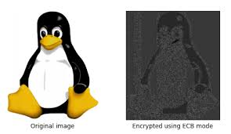

## [WeakEncryption.py](../../examples/insecure/python/WeakEncryption.py)
Path: `/examples/insecure/python/WeakEncryption.py`

### Explanation

- It is not recommended to use ECB (Electronic Codebook) mode in AES encryption (line 1) because this mode encrypts data block by block without proper randomization. Instead, CBC (Cipher Block Chaining) mode or other cryptographically secure methods should be used. 

- When encryption is performed using ECB, patterns in the input data can still be observed in the output, making it insecure for certain types of data, especially images. For example:
   - If a block of data (a byte) is changed, only the specific block in the output is affected and the rest remains unchanged. This behavior is not suitable for encryption of sensitive or visual data.

- A visual example of ECB's block-by-block encoding is the well-known "ECB Tux" image:  
    
  As seen in this example, the penguin shape remains recognizable in the encrypted image, demonstrating ECB's vulnerability.

To better understand this vulnerability, I recommend reviewing the resources listed under cryptography in [Articles.md](../../docs/references/Articles.md).
